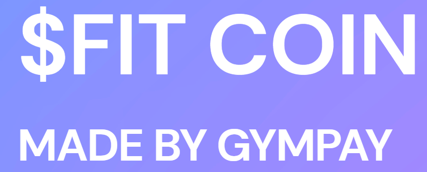

# Gympay-Blockchain

# 

## Overview

An ERC20 Token built for fast and cheap transactions for Gym memberships, maximising profit and customer satisfation called $FIT coin.

Built using Solidity for contract logic and Streamlit for the frontend to buy $FIT.

## Use and Installation
Chrome willl be the best browser to utilise in order to use Remix and view the streamlit application to view the $FIT coin homepage.

1. Install Remix
2. Install Ganache
3. Have a MetaMask Account
4. Link the relevant Ganache accounts and import into MetaMask
5. Run (compile) the solidity file within Remix
6. Then deploy within Injected Web3 environment
7. Using GitBash streamlit run app.py
8. Login within the authenticator using username and login details
9. Then are then able to view $FIT coin homepage to buy, sell and contact the GymPay team

## GymPay research

You can use the links below to look at the data anaylsis and cost savings researched for the GymPay project.

1. [GymPay Market Research](https://github.com/Dottie-Doutre/GymPay/blob/main/GYMPAY_MARKET_RESEARCH_2022.docx.pdf)  
2. [GymPay Presentation](https://github.com/Dottie-Doutre/GymPay/blob/main/Gympay_presentation.pdf)

## Built With
- Solidity
- Streamlit
- OpenZepplin
- Pandas
- Ganache
- Remix

## $FIT Coin presentation

You can find the presentation within the Documents folder above.

## Screenshots - $FIT Coin Streamlit

Login Page

Home Page

Wallet Page

Transaction Page

Research Page

Contact Page

## Versioning
One branch (main) was used for version control. 

The team pushed changes with detailed comments regarding changes made.

## Authors

Anthony Mura

Kevin Chen 

Craig Braganza 

Dorothy Doutre 

